# Installer le terminal

Choix porté sur zsh/oh-my-zsh & tmux

Utilisation de ansible-galaxy histoire de pas y passer 1000 ans

Choix d'un repo avec une bonne pertinence [zsh repo + oh-my + theme](https://galaxy.ansible.com/viasite-ansible/zsh)

Récupération de la commande en one shot (dans l'onglet README) qui comporte l'installation d'ansible et tout x)

```bash
> curl https://raw.githubusercontent.com/viasite-ansible/ansible-role-zsh/master/install.sh | bash
```

**Important** : Relancer le terminal

// FONTS KO


## Installer les polices pour le terminal WLS

[Lien recommandé](https://github.com/microsoft/WSL/issues/91#issuecomment-220369715)

### Choix d'une police

**Prendre une TTF !** / et attention aux [restrictions](https://superuser.com/questions/583835/adding-microsoft-console-cmd-font-in-registry-does-not-work-with-eastern-asian) windaube.

[Powerline fonts preview](https://github.com/powerline/fonts/blob/master/samples/All.md)

DejaVuSansMono, reco par le mec ansible // **La seule qui marche sur 4-5 de testées**.

~~Meslo LG M, thème reco OMZ~~ // KO Parce que nique la logique
~~Source code + FA~~ // KO

### Installer de manière régulière

- Télécharger [les polices](https://github.com/powerline/fonts) via github
- Extraire > Installer

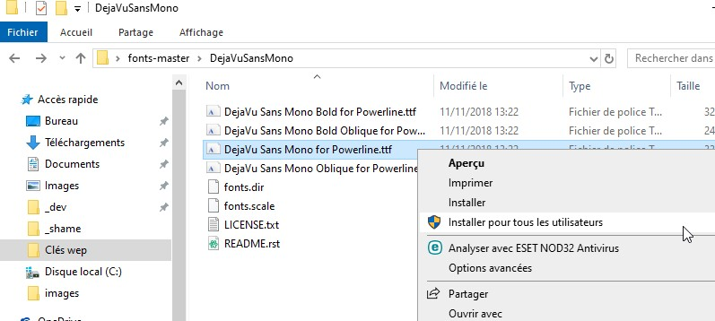

### Installation pour windows, via le registre

*Accès au registre* : Windows "demarrer" > Taper "Registr"..)

- Editeur de registre > Ordinateur\HKEY_LOCAL_MACHINE\SOFTWARE\Microsoft\Windows NT\CurrentVersion\Fonts
  - Récupérer le nom de la police, sans (TrueType), ex: "DejaVu Sans Mono for Powerline" (C/C depuis Registre > Renommer)

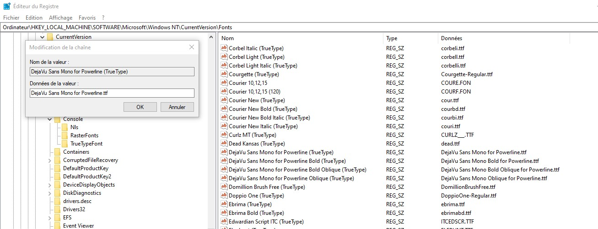

- Editeur de registre > Ordinateur\HKEY_LOCAL_MACHINE\SOFTWARE\Microsoft\Windows NT\CurrentVersion\Console\TrueTypeFont
  - Nouvelle entrée > 00 (ou 000, 0000, 00000, etc. si déjà pris)
  - "DejaVu Sans Mono for Powerline"

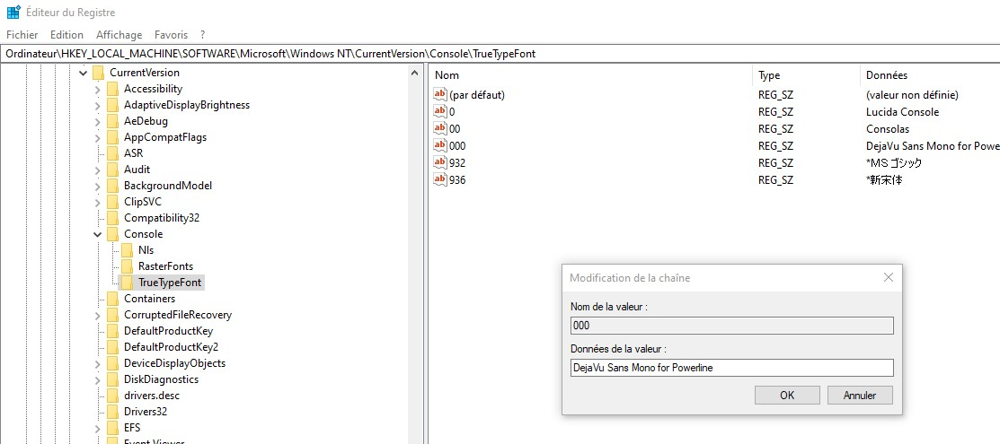

- **Rebooter le pc**

### Utilisation dans WLS

- WLS > Barre du haut > Clic droit > Propriétés > Polices > "DejaVu Sans Mono for Powerline"

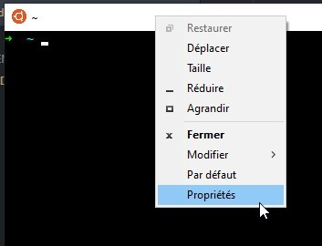


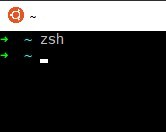

- yay

#### Liens

- [WSL issue / Oh-my-zsh's icons don't show correctly #1517](https://github.com/Microsoft/WSL/issues/1517)
- [Windows Change console font](https://superuser.com/questions/5035/how-to-change-the-windows-xp-console-font)

## Configurer oh-my-zsh

Parce que ca ressemble toujours a de la merde pour le moment

[Doc OMZ](https://github.com/ohmyzsh/ohmyzsh#themes) / C'est normal, thème par défaut ultra basique

### Choisir un thème

- [Agnoster](https://github.com/ohmyzsh/ohmyzsh/wiki/Themes#agnoster)
- [Powerlevel10k](https://gist.github.com/kevin-smets/8568070#powerlevel9k--powerlevel10k) / Plus facile a configurer
  - Pas de font icons sur windows a priori (restrictions)

Les deux ont les trucs git et tout. je reste sur PL10k car le chemin des dossiers est tronqué (Wia WLS, si on bosse en local, il faut accéder à ses projets via `/mnt/c/Users/MONNOM/.../` ce qui prend pas mal de place).

### Mise en place du thème de base (agnoster)

**Mise en place** du thème

[Lien cookbook galaxy](https://galaxy.ansible.com/viasite-ansible/zsh) > Rechercher "Configure"

.. et ne pas suivre les recos, ça ne marche pas.

**Rappel vi** / L'éditeur de texte de base du terminal

- Par défaut on est pas en mode insertion (on ne peut pas modifier)
- "i" pour insérer/modifier du texte, puis échap pour revenir au mod normal
- ":wq" / sauvegarder et quitter

> ~~sudo cp ~/.zshrc /etc/zshrc.local~~
> ~~sudo vi /etc/zshrc.local~~
> ~~sudo cp ~/.zshrc ~/.zshrc.local~~
> ~~sudo vi ~/.zshrc.local~~
> sudo vi ~/.zshrc

Remplacer `ZSH_THEME="robbyrussell"` par `ZSH_THEME="agnoster"`, avec vi.

Et c'est toujours aussi dégeulasse.

### Mise en place des couleurs de terminal

A éditer à la main à partir des sources ([theme solarized](https://ethanschoonover.com/solarized/)) dans le registre windaube.

Ou sinon un mec l'a déjà fait en édition 1 clic : [solarized for windaube](https://github.com/nsilvestri/solarized-dark-for-wsl).

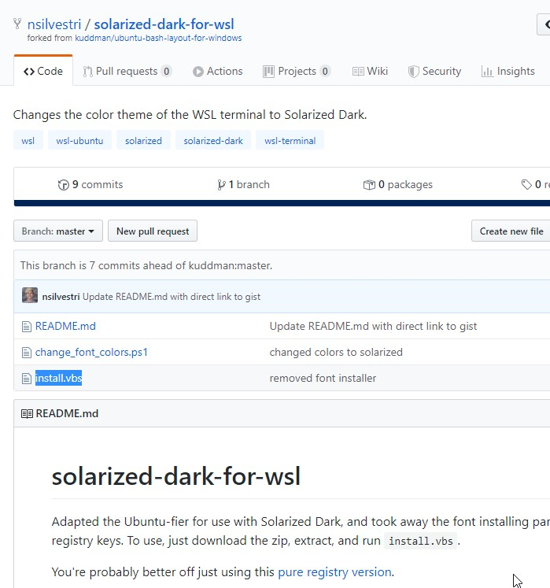

Possibilité de fixer de la transparence également.


*Exemple final* avec thème OMZ agnoster

### Optionnel > theme Powerlevel10k

*Note : Je ne sais pas si le fait d'avoir installé l'autre thème avant joue..*

[Reco](https://gist.github.com/kevin-smets/8568070#powerlevel9k--powerlevel10k)

```bash
> sudo git clone https://github.com/romkatv/powerlevel10k.git $ZSH_CUSTOM/themes/powerlevel10k
```

Then edit your ~/.zshrc and set ZSH_THEME="powerlevel10k/powerlevel10k".

Relancer terminal, et suivre l'installation de la configuration.

Valider.

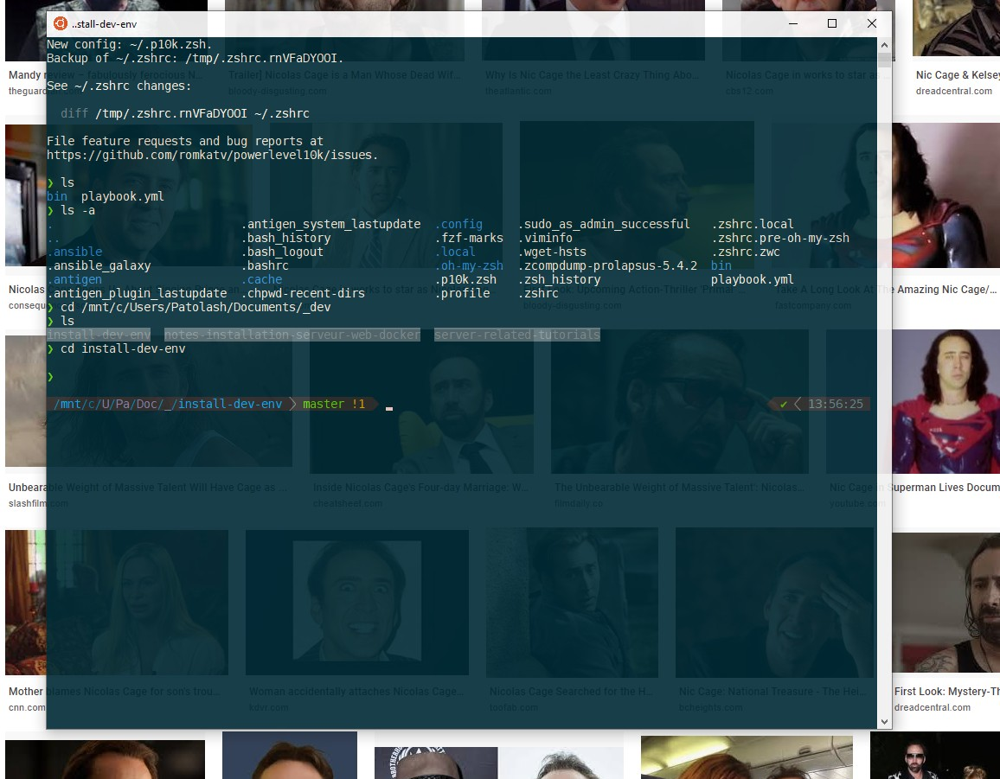

## Onglets multiples & autres

**Edit** : Au final je passe directement pas le bash ubuntu.

Ajouter l'icône WSL à la barre des tâches, clic droit > ubuntu. Cela ouvre une nouvelle instance (Mais pas un nouvel onglet).

---

MobaXterm > Utilitaire de terminal multiple windows, avec pas mal de commandes de base

- [SO / Multiple terminal windows in Windows Ubuntu?](https://askubuntu.com/a/1142676)
- [MobaXterm / Blog release 9.0](https://blog.mobatek.net/post/mobaxterm-new-release-9.0/) / Utilitaire windows anti cancer
- [MobaXterm / Téléchargement](https://mobaxterm.mobatek.net/download-home-edition.html) / Installer edition

Une fois installé, configurer une session WSL/Ubuntu par défaut :

- Supprimer la session par défaut
- Session > WSL > Ubuntu

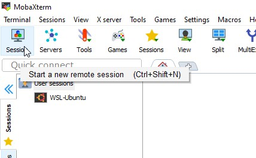

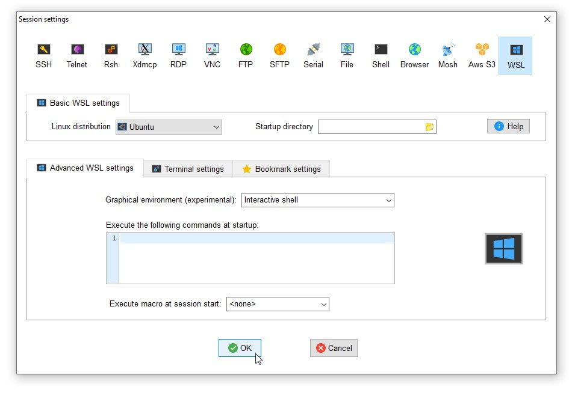

- Nommer in Bookmark settings

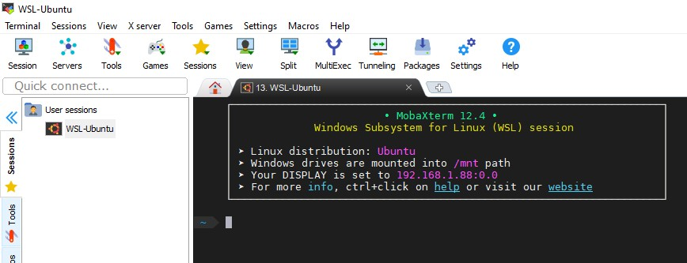

### Fixer le répertoire par défaut

Onglet macro > enregistrer

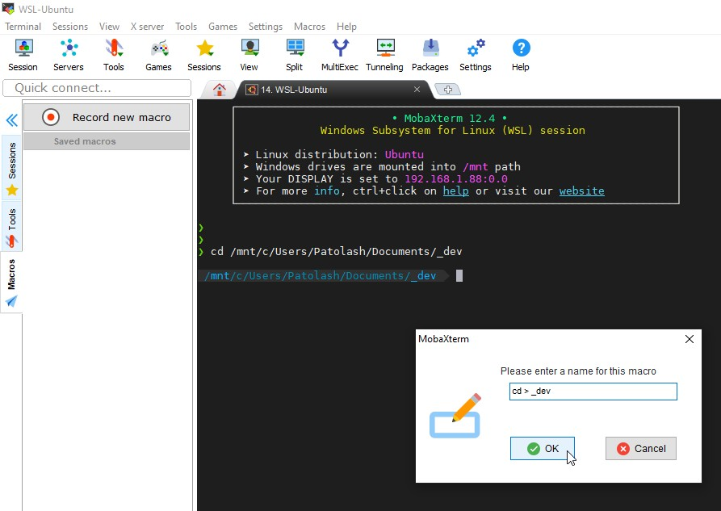

> cd /mnt/c/Users/XXXX/CheminVersProjets

- Arreter l'enregistrement
- Nommer
- Onglet session > (la session créée ci-dessus) > clic droit > edit session > Advanced SWL settings > execute macro > choisir la macro

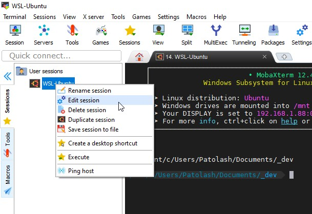

- Tester

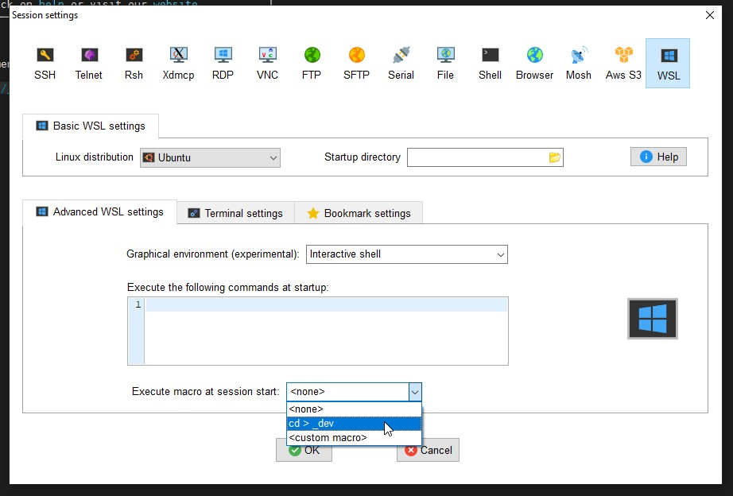

#### Plein le q

*Après pas mal de galères..*

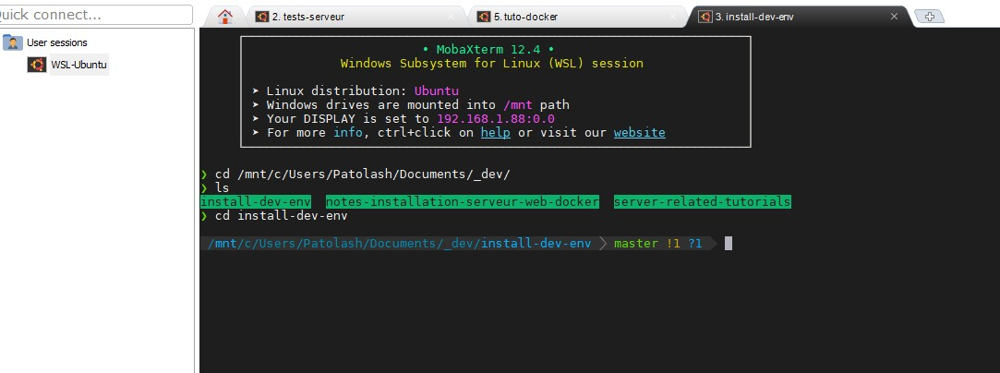
