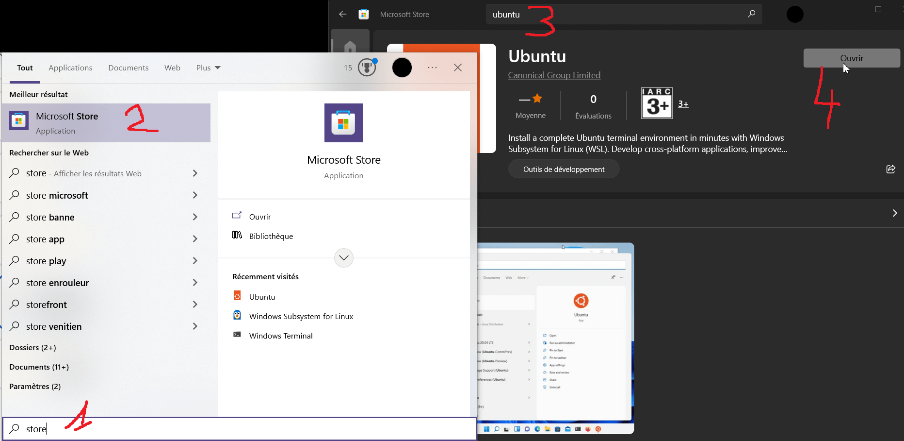
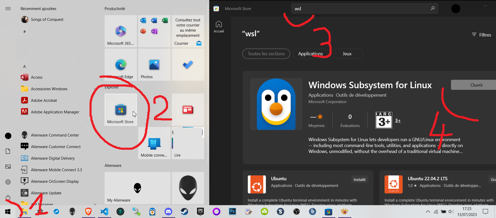
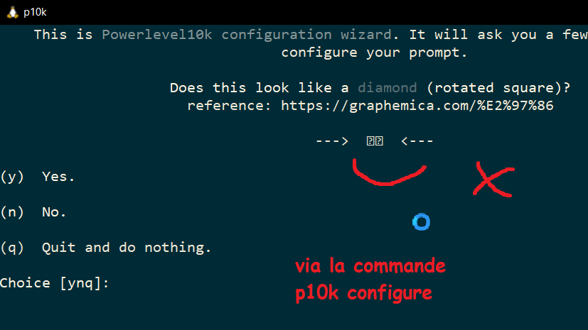
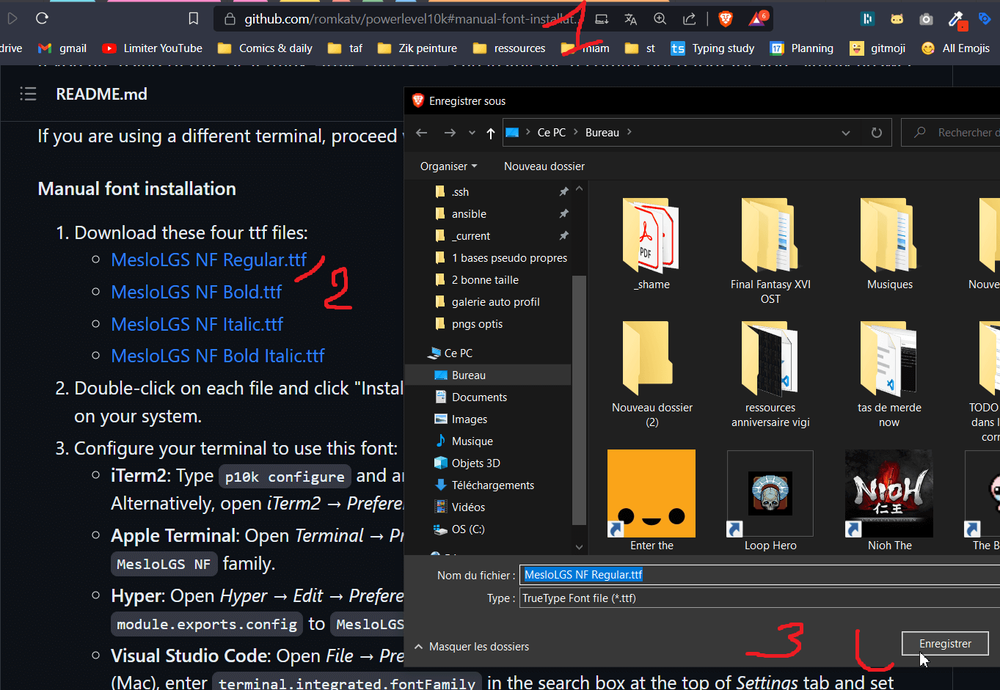
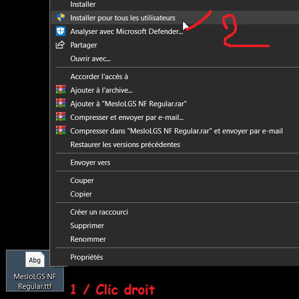
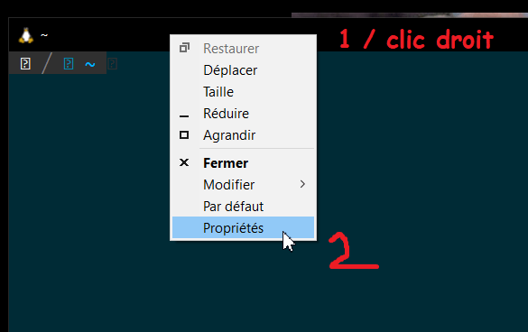
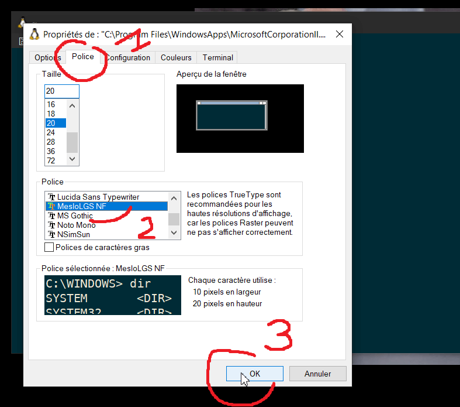
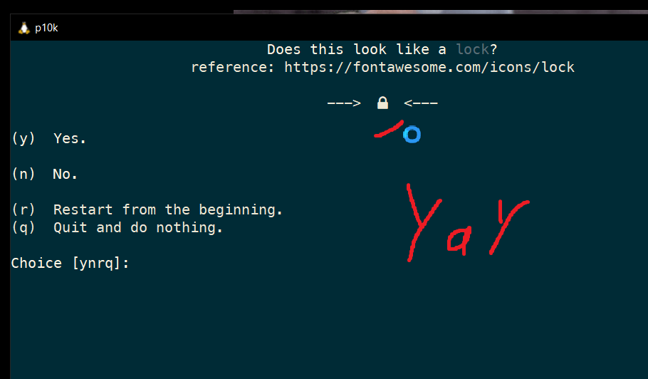

# Installer & configurer un terminal sur Windows

WSL2 (Windows Sub Linux), mise à jour vers Ubuntu 22.

Configuration des couleurs (thème solarized) et autres.

Installation des thèmes zsh & OMZ & p10K ainsi que leurs pré-requis.

## 🐧 WSL2 > Ubuntu LTS pour windows 10

Le terminal que je recommande d'utiliser pour Windows, [Kwaksé](https://docs.microsoft.com/fr-fr/windows/wsl/about).

Permet d'avoir un "vrai" système de fichier (~vire le bullshit `CRLF`, les droits & permissions, etc.) sur Windows, sans machine virtuelle.

Pas besoin pour Mac & Linux.

---

📝 Note : WSL 🚨doit🚨 avoir une version de linux installée 🚨avant🚨 afin de pouvoir tourner, ici Ubuntu.

---

Passer par le microsoft store > Ubuntu, **puis** WSL.

---

1. Démarrer > Microsoft store
2. "Ubuntu", sans version afin d’avoir la dernière
3. Télécharger & installer
4. "WSL" ou "Windows Subsystem for Linux"
5. Télécharger & installer

---

Installer *Ubuntu via le MS Store*



---

Installer *WSL via le MS Store*



---
---
---

### 🔧 Configuration manuelle

Voici les opérations résumées à partir des repos officiels

- Terminal > clic droit sur la barre du haut > Propriétés > (Options) > ✅ Utiliser `Ctrl` + `Shift` + `C`/`V` pour copier coller (cela évite les clics droit).
- 🚨Pré-installation des [polices🚨 reco pour le thème](https://github.com/romkatv/powerlevel10k#manual-font-installation)
  - Télécharger & installer de manière classique (clic droit > installer).
  - Redémarrer le terminal
  - Terminal > clic droit sur la barre du haut > Propriétés > Police > MesloLGS.
  - Redémarrer le terminal
  - (Je reco une taille de police de 16, et d'en profiter pour régler la taille par défaut de la fenêtre afin de permettre d'afficher de multiples terminaux)
- Changement automatique des couleurs pour [solarized dark](https://github.com/youpiwaza/backup-solarized-dark-for-wsl) (~maj des registres en RGB).
  - Cloner, lancer `install.vbs`, relancer le terminal.

---

#### 👶🗚 Pas à pas installation de la police pour le terminal

01 / Probleme rencontré : symboles non affichés



---

02 / Télécharger la police



---

03 / Installer la police



---

04 / WSL > Propriétés



---

05 / WSL > Utiliser la police



---

06 / Test > `p10k configure` > is ok



---
---
---

### 📝 Quelques commandes de terminal usuelles, sous linux

[README dédié](./commandes.md)

---

### ⬆️ Mise à jour vers la dernière version d'Ubuntu

Un [article](https://linuxconfig.org/how-to-upgrade-ubuntu-to-22-04-lts-jammy-jellyfish) dédié.

```bash
# Assurer les dernières maj & suppressions des paquets deprecated
sudo apt dist-upgrade && sudo apt -y autoremove

# Installation du paquet de maj
sudo apt install update-manager-core

# Installer la dernière version, même si elle n'est pas encore sortie (~22.04)
#   🚨 Attention, besoin d'actions manuelles de validation
sudo do-release-upgrade -d

# (Restart du terminal)

# Vérifier la version
lsb_release -a

# Dernière maj paquets au cazou
sudo apt update && sudo apt --fix-broken install && sudo apt -y upgrade && sudo apt dist-upgrade && sudo apt -y autoremove
```

---

### (Optionnel) Installation des paquets usuels

🔍 Doc sur l'[installation de paquets](https://doc.ubuntu-fr.org/tutoriel/comment_installer_un_paquet) : Préférer utiliser `apt install` plutôt que `apt-get install`, plus récent.

Editeurs de textes dans le terminal

```bash
apt install vim
apt install nano
```

Mini doc maison pour apprendre à utiliser les [éditeurs de textes / fichiers](./nano-vim.md) sous terminal.

---

- NodeJs, npm, yarn
- python

```bash
# Installations chainées
echo "deb https://dl.yarnpkg.com/debian/ stable main" && \
sudo apt update && \
sudo apt -y install nodejs && \
sudo apt -y install npm && \
sudo apt -y install yarn && \
sudo apt -y install software-properties-common && \
sudo add-apt-repository ppa:deadsnakes/ppa -y && \
sudo apt -y install python3.11

# Vérifications
echo "test node: " && nodejs -v && \
echo "test npm: " && npm -v && \
echo "test python3: " && python3.11 --version && \
echo "test yarn: " && yarn --version
```

---

## Restreindre WSL2 en RAM

[blah](https://youtu.be/idW-an99TAM?t=1515)

```bash
nano /mnt/c/Users/WINDOWS_USER/.wslconfig
```

Y ajouter

```ini
[wsl2]
memory=6GB
```

Redémarrer WSL2 (fermer & rouvrir le terminal)

---

### (Optionnel) Switcher sur l'utilisateur root par défaut

Parce que l'utilisateur normal peut déconner/merder au niveau de l'attribution des droits, et parce que `sudo` c'relou en local

```bash
## Depuis un INVITE DE COMMANDE WINDOWS, lancé en administrateur
##    https://superuser.com/questions/1107986/how-to-sign-into-root-account-by-default-on-windows-subsystem-for-linux-bash-t#comment2465514_1291457
## Ubuntu 18
ubuntu config --default-user root

## Ubuntu 20+
ubuntu2004 config --default-user root
```

(Relancer le terminal WSL > Ubuntu)

---

## 🎨 zsh & OMZ & p10k

Pas mal de raccourcis, configuration, optimisation des performances, fonctions supplémentaires, personnalisation

Comprend l'installation d'*Ansible* 🤖 dont l'installation à besoin.

```bash
## Edit 2021: En cas de réinstallation/mise à jour de ubuntu (avec les fichiers ~/.zshrc partagés -_-)
## Supprimer les fichiers avant de faire la manip, sinon l'installation via le script ne se fera pas correctement
##   Pas de conf lors de la relance du terminal ; A noter que ça pète la conf précédente !
##   ..Mais sera remise en place via install du terminal, faites juste gaffe si conf a la mano (raccourcis, etc.).

## Supprimer la conf de zsh
# rm ~.zsh*

## Script auto, comprend l'installation d'ansible (mais merde un peu donc on refait au propre le reste ci-dessous)
curl https://raw.githubusercontent.com/viasite-ansible/ansible-role-zsh/master/install.sh | bash


## Terminal Oh My Zsh, installation officielle / https://github.com/ohmyzsh/ohmyzsh#basic-installation
# OMZ > curl install
sh -c "$(curl -fsSL https://raw.githubusercontent.com/robbyrussell/oh-my-zsh/master/tools/install.sh)"


## Theme powerlevel10k official installation for OMZ / https://github.com/romkatv/powerlevel10k#oh-my-zsh
git clone --depth=1 https://github.com/romkatv/powerlevel10k.git ${ZSH_CUSTOM:-$HOME/.oh-my-zsh/custom}/themes/powerlevel10k

## Activer le thème
nano ~/.zshrc

## Maj dans le fichier la variable du thème
>> # ZSH_THEME="robbyrussell"
>> ZSH_THEME="powerlevel10k/powerlevel10k"

## Redémarrer le terminal, un questionnaire doit s'afficher
# (...)

## Sinon, lancer le questionnaire
# p10k configure
```

Remplir le questionnaire selon les préférences. Profit.

### 📝 Notes

- Plutôt que de partir d'un mec qui en parle, utiliser leS vraiS repoS
  - du terminal [OMZ](https://github.com/ohmyzsh/ohmyzsh)
  - du theme [PowerLevel10k](https://github.com/romkatv/powerlevel10k).
- 🐛⚡️ Le terminal est lent AF après l'install du script ansible, mais c'est corrigé via le theme PL10K
  - Note c'est même putain de rapide, plus de soucis d'inputs mangés ou quoi ; cf [demo](https://asciinema.org/a/NHRjK3BMePw66jtRVY2livHwZ).
- Le thème dispose également d'une chiée d'[options de base](https://github.com/romkatv/powerlevel10k#batteries-included), relatives au confort, voir a différents langages, env. de dev/prod, etc. mais également de plugins.

---

### ⬆️ Mises à jour

```bash
## (Manual update OMZ)
omz update

## (Manual update / theme p10k)
git -C ${ZSH_CUSTOM:-$HOME/.oh-my-zsh/custom}/themes/powerlevel10k pull

## (opt) Mettre à jour la liste des paquets/packages, puis mettre à jour les paquets
sudo apt update && sudo apt --fix-broken install && sudo apt -y upgrade

## One liner
omz update && git -C ${ZSH_CUSTOM:-$HOME/.oh-my-zsh/custom}/themes/powerlevel10k pull && sudo apt update && sudo apt --fix-broken install && sudo apt -y upgrade
```

---

## 💾 Installation du CLI github

Installation du [CLI github](https://github.com/cli/cli), via [homebrew](https://brew.sh/).

```bash
# Installation de homebrew, l'utilisateur doit être différent de root
/bin/bash -c "$(curl -fsSL https://raw.githubusercontent.com/Homebrew/install/HEAD/install.sh)"

# Ajout au PATH
echo 'eval "$(/home/linuxbrew/.linuxbrew/bin/brew shellenv)"' >> /home/VOTRE_UTILISATEUR_WSL2/.profile
eval "$(/home/linuxbrew/.linuxbrew/bin/brew shellenv)"

# Installation des dépendances & des recos
sudo apt-get install build-essential
brew install gcc

# Installation du CLI github
brew install gh
```

---

## ♻️ Maintenance

[WSL2](https://nickjanetakis.com/blog/reclaiming-tons-of-diskspace-by-compacting-your-docker-desktop-wsl-2-vm)

cmd ou Powershell > run as admin

```bash
# Close all WSL terminals and run this to fully shut down WSL.
## Notification > NON je ne veux pas redémarrer, pour le moment
wsl.exe --shutdown

# Replace WINDOWS_USER with your Windows user name. This is where Docker stores its VM file.
cd C:\Users\WINDOWS_USER\AppData\Local\Docker\wsl\data\

# Compact the Docker Desktop WSL VM file and you're done.
# NOTE: This may not work with Windows Home edition (read below).
optimize-vhd -Path .\ext4.vhdx -Mode full
```

Relancer docker desktop

---

## 📝 Ressources

1. Installation originale [zsh theme > powerlevel10k](https://github.com/romkatv/powerlevel10k#meslo-nerd-font-patched-for-powerlevel10k)
2. 💾🗚 La police `MesloLGS NF`, qui permet l'affichage des icônes "dev", est sauvegardée dans le dossier [/fonts](./fonts)
3. 👴📝 Anciennes [notes](./old.md) en cas de problème, qui proposent quelques fixs

---

## 🔗 (Optionnel) Mise en place de connexion SSH depuis WSL

Permet un accès direct au serveur depuis WSL. En gros partager les fichiers de clés de windows via un lien.

WSL2 a besoin d'un peu plus de conf:

- [SO / Ubuntu on windows 10 wsl2 - chown chmod doesn't work on copied files](https://stackoverflow.com/questions/63600692/ubuntu-on-windows-10-wsl2-chown-chmod-doesnt-work-on-copied-files)
- ['crosoft > Sharing SSH keys between Windows and WSL 2](https://devblogs.microsoft.com/commandline/sharing-ssh-keys-between-windows-and-wsl-2/)
- [old article, but see comments](https://florianbrinkmann.com/en/ssh-key-and-the-windows-subsystem-for-linux-3436/).

```bash
## Ajouter la gestion des metadatas à wsl
nano /etc/wsl.conf
```

Rajouter dans la conf..

```ini
[automount]
enabled = true
options = "metadata,uid=1000,gid=1000,umask=0022,fmask=11,case=off"
mountFsTab = false
crossDistro = true

[filesystem]
umask = 0022

[network]
generateHosts = true
generateResolvConf = true

[interop]
enabled = true
appendWindowsPath = true
```

Puis **forcer le redémarrage** du terminal WSL via **(WINDOWS) > CMD** (en admin) > `wsl --shutdown`.

```bash
## Dossier de l'utilisateur courant
cd

## Création du lien symbolique vers les clés SSH windows
# ln -s /mnt/c/Users/WINDOWS_USER/.ssh ~/.ssh
ln -s /mnt/c/Users/masam/.ssh ~/.ssh

## Ajustement des droits
# chown UBUNTU_USER:UBUNTU_USER ~/.ssh 
# chown UBUNTU_USER:UBUNTU_USER ~/.ssh/*
chown root:root ~/.ssh 
chown root:root ~/.ssh/*
## Note: Si les clés ne sont pas chmod 600 (ou moins), c'est considéré comme une faille de sécurité et elles ne fonctionnent pas
chmod 600 ~/.ssh/*

ls -la
# ...
# lrwxrwxrwx  1 UBUNTU_USER UBUNTU_USER    26 Jun  2 11:49 .ssh -> /mnt/c/Users/WINDOWS_USER/.ssh

ls -lah ~/.ssh/
```

Note: Toujours pas de solution miracle pour connexion en 1 commande (`.ssh/config` redemande la passphrase systématiquement..)

cf. [Repo dédié](https://github.com/youpiwaza/server-related-tutorials/tree/master/02-ansible/01-configuration-ssh) pour les détails.

---

## 🐛 Problèmes / Troubleshootings

### 🔌 WSL Can't connect to the internet

Peut arriver de manière aléatoire...

[SO Resource](https://stackoverflow.com/questions/62314789/no-internet-connection-on-wsl-ubuntu-windows-subsystem-for-linux)

Lancer `cmd` ou `powershell` en tant qu'administrateur.

```bash
# No need to reboot if you shutdown WSL beforehand
wsl --shutdown
netsh winsock reset
netsh int ip reset all
netsh winhttp reset proxy
ipconfig /flushdns
```

Vous pouvez tester `/etc/resolv.conf` pour vous assurer que les adresses IP on bien changées après la manipulation.
