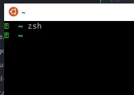
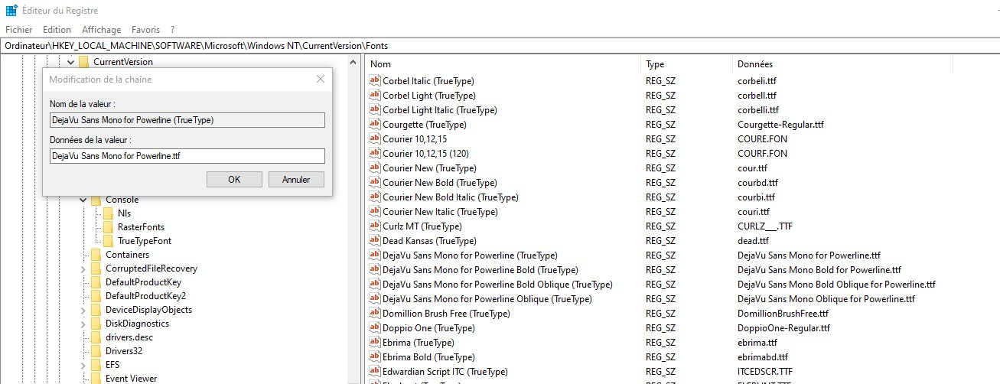
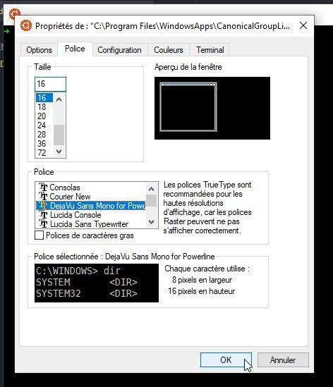
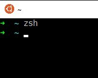
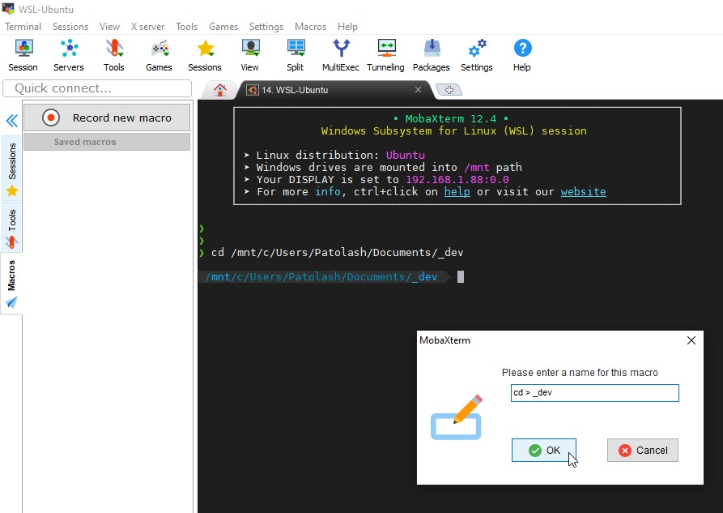
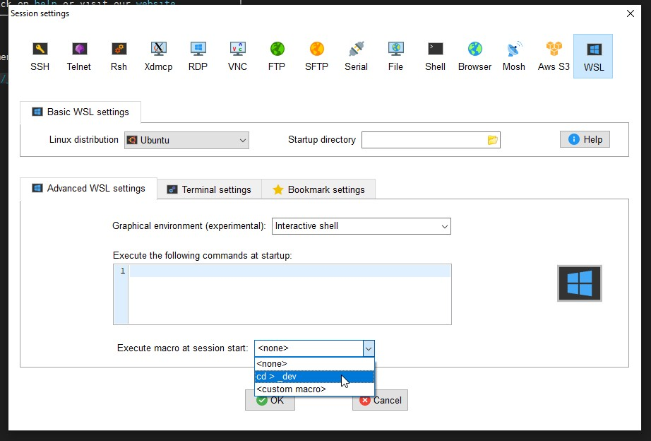
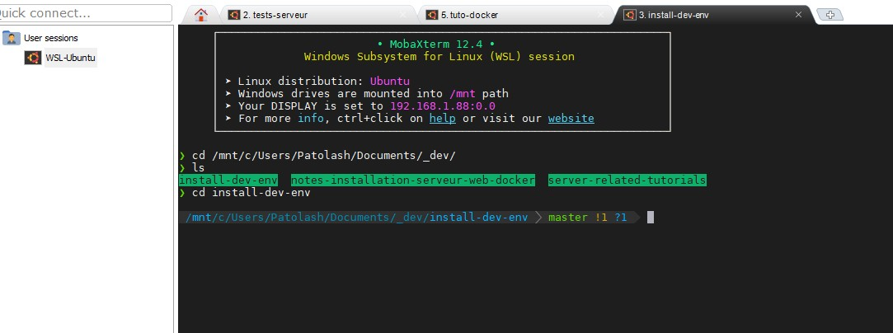

# Installer le terminal sur Windows > WSL (Windows Sub Linux > Ubuntu 22) : OMZ & p10K

Installation du **terminal** *Oh My Zsh* et du **Thème** *PowerLevel10k*.

Cay über rapide, pratique et joli.

## Edit 06/2021 : Clean & concis 🐬

Voici les opérations résumées à partir des repos officiels

- Terminal > clic droit sur la barre du haut > Propriétés > (Options) > ✅ Utiliser Ctrl + Shift + C/V pour copier coller (cela évite les clics droit).
- Pré-installation des polices reco pour le thème : [ici](https://github.com/romkatv/powerlevel10k#manual-font-installation)
  - Télécharger & installer de manière classique (clic droit > installer).
  - Terminal > clic droit sur la barre du haut > Propriétés > Police > MesloLGS.
  - Redémarrer le terminal
  - (Je reco une taille de police de 16, et d'en profiter pour régler la taille par défaut de la fenêtre afin de permettre d'afficher de multiples terminaux)
- Changement automatique des couleurs pour [solarized dark](https://github.com/youpiwaza/backup-solarized-dark-for-wsl) (~maj des registres en RGB).
  - Cloner, lancer `install.vbs`, relancer le terminal.

```bash
## Edit 2021: En cas de réinstallation/mise à jour de ubuntu (avec les fichiers ~/.zshrc partagés -_-)
## Supprimer les fichiers avant de faire la manip, sinon l'installation via le script ne se fera pas correctement
##   Pas de conf lors de la relance du terminal ; A noter que ça pète la conf précédente !
##   ..Mais sera remise en place via install du terminal, faites juste gaffe si conf a la mano (raccourcis, etc.).

## Supprimer la conf de zsh
# rm ~.zsh*

## Script auto, comprend l'installation d'ansible (mais merde un peu donc on refait au propre le reste ci-dessous)
curl https://raw.githubusercontent.com/viasite-ansible/ansible-role-zsh/master/install.sh | bash


## Terminal Oh My Zsh, installation officielle / https://github.com/ohmyzsh/ohmyzsh#basic-installation
# OMZ > curl install
sh -c "$(curl -fsSL https://raw.githubusercontent.com/robbyrussell/oh-my-zsh/master/tools/install.sh)"


## Theme powerlevel10k official installation for OMZ / https://github.com/romkatv/powerlevel10k#oh-my-zsh
git clone --depth=1 https://github.com/romkatv/powerlevel10k.git ${ZSH_CUSTOM:-$HOME/.oh-my-zsh/custom}/themes/powerlevel10k

## Activer le thème
nano ~/.zshrc

## Maj dans le fichier la variable du thème
>> # ZSH_THEME="robbyrussell"
>> ZSH_THEME="powerlevel10k/powerlevel10k"

## Redémarrer le terminal, un questionnaire doit s'afficher
# (...)

## Sinon, lancer le questionnaire
# p10k configure
```

Remplir le questionnaire selon les préférences. Profit.

### Notes

- Plutôt que de partir d'un mec qui en parle, utiliser leS vraiS repoS
  - du terminal [OMZ](https://github.com/ohmyzsh/ohmyzsh)
  - du theme [PowerLevel10k](https://github.com/romkatv/powerlevel10k).
- Je laisse les anciennes notes en cas de problème..
- Le terminal est lent AF après l'install du script ansible, mais c'est corrigé via le theme PL10K
  - Note c'est même putain de rapide, plus de soucis d'inputs mangés ou quoi ; cf [demo](https://asciinema.org/a/NHRjK3BMePw66jtRVY2livHwZ).
- Le thème dispose également d'une chiée d'[options de base](https://github.com/romkatv/powerlevel10k#batteries-included), relatives au confort, voir a différents langages, env. de dev/prod, etc. mais également de plugins.
- Je devais être fin claqué/au bout de ma vie lors de la première installation lel

### Mises à jour

```bash
## (Manual update OMZ)
omz update

## (Manual update / theme p10k)
git -C ${ZSH_CUSTOM:-$HOME/.oh-my-zsh/custom}/themes/powerlevel10k pull

## (opt) Mettre à jour la liste des paquets/packages, puis mettre à jour les paquets
sudo apt update && sudo apt --fix-broken install && sudo apt -y upgrade

## One liner
omz update && git -C ${ZSH_CUSTOM:-$HOME/.oh-my-zsh/custom}/themes/powerlevel10k pull && sudo apt update && sudo apt --fix-broken install && sudo apt -y upgrade
```

## Installation du CLI github

Installation du [CLI github](https://github.com/cli/cli), via [homebrew](https://brew.sh/).

```bash
# Installation de homebrew, l'utilisateur doit être différent de root
/bin/bash -c "$(curl -fsSL https://raw.githubusercontent.com/Homebrew/install/HEAD/install.sh)"

# Ajout au PATH
echo 'eval "$(/home/linuxbrew/.linuxbrew/bin/brew shellenv)"' >> /home/VOTRE_UTILISATEUR/.profile
eval "$(/home/linuxbrew/.linuxbrew/bin/brew shellenv)"

# Installation des dépendances & des recos
sudo apt-get install build-essential
brew install gcc

# Installation du CLI github
brew install gh
```

---
---
---

## Old 👴💩

Choix porté sur zsh/oh-my-zsh & tmux

Utilisation de ansible-galaxy histoire de pas y passer 1000 ans

Choix d'un repo avec une bonne pertinence [zsh repo + oh-my + theme](https://galaxy.ansible.com/viasite-ansible/zsh)

Récupération de la commande en one shot (dans l'onglet README) qui comporte l'installation d'ansible et tout x)

```bash
# Éxécuter le script auto
curl https://raw.githubusercontent.com/viasite-ansible/ansible-role-zsh/master/install.sh | bash
```

**Important** : Relancer le terminal

// FONTS KO



## Installer les polices pour le terminal WLS

[Lien recommandé](https://github.com/microsoft/WSL/issues/91#issuecomment-220369715)

### Choix d'une police

**Prendre une TTF !** / et attention aux [restrictions](https://superuser.com/questions/583835/adding-microsoft-console-cmd-font-in-registry-does-not-work-with-eastern-asian) windaube.

[Powerline fonts preview](https://github.com/powerline/fonts/blob/master/samples/All.md)

DejaVuSansMono, reco par le mec ansible // **La seule qui marche sur 4-5 de testées**.

~~Meslo LG M, thème reco OMZ~~ // KO Parce que nique la logique
~~Source code + FA~~ // KO

### Installer de manière régulière

- Télécharger [les polices](https://github.com/powerline/fonts) via github
- Extraire > Installer


### Installation pour windows, via le registre

*Accès au registre* : Windows "demarrer" > Taper "Registr"..)

- Editeur de registre > Ordinateur\HKEY_LOCAL_MACHINE\SOFTWARE\Microsoft\Windows NT\CurrentVersion\Fonts
  - Récupérer le nom de la police, sans (TrueType), ex: "DejaVu Sans Mono for Powerline" (C/C depuis Registre > Renommer)



- Editeur de registre > Ordinateur\HKEY_LOCAL_MACHINE\SOFTWARE\Microsoft\Windows NT\CurrentVersion\Console\TrueTypeFont
  - Nouvelle entrée > 00 (ou 000, 0000, 00000, etc. si déjà pris)
  - "DejaVu Sans Mono for Powerline"


- **Rebooter le pc**

### Utilisation dans WLS

- WLS > Barre du haut > Clic droit > Propriétés > Polices > "DejaVu Sans Mono for Powerline"






- yay

#### Liens

- [WSL issue / Oh-my-zsh's icons don't show correctly #1517](https://github.com/Microsoft/WSL/issues/1517)
- [Windows Change console font](https://superuser.com/questions/5035/how-to-change-the-windows-xp-console-font)

## Configurer oh-my-zsh

Parce que ca ressemble toujours a de la merde pour le moment

[Doc OMZ](https://github.com/ohmyzsh/ohmyzsh#themes) / C'est normal, thème par défaut ultra basique

### Choisir un thème

- [Agnoster](https://github.com/ohmyzsh/ohmyzsh/wiki/Themes#agnoster)
- [Powerlevel10k](https://gist.github.com/kevin-smets/8568070#powerlevel9k--powerlevel10k) / Plus facile a configurer
  - Pas de font icons sur windows a priori (restrictions)

Les deux ont les trucs git et tout. je reste sur PL10k car le chemin des dossiers est tronqué (Wia WLS, si on bosse en local, il faut accéder à ses projets via `/mnt/c/Users/MONNOM/.../` ce qui prend pas mal de place).

### Mise en place du thème de base (agnoster)

**Mise en place** du thème

[Lien cookbook galaxy](https://galaxy.ansible.com/viasite-ansible/zsh) > Rechercher "Configure"

.. et ne pas suivre les recos, ça ne marche pas.

**Rappel vi** / L'éditeur de texte de base du terminal

- Par défaut on est pas en mode insertion (on ne peut pas modifier)
- "i" pour insérer/modifier du texte, puis échap pour revenir au mod normal
- ":wq" / sauvegarder et quitter

```bash
# KO / sudo cp ~/.zshrc /etc/zshrc.local
# KO / sudo vi /etc/zshrc.local
# KO / sudo cp ~/.zshrc ~/.zshrc.local
# KO / sudo vi ~/.zshrc.local
sudo vi ~/.zshrc
```

Remplacer `ZSH_THEME="robbyrussell"` par `ZSH_THEME="agnoster"`, avec vi.

Et c'est toujours aussi dégeulasse.

### Mise en place des couleurs de terminal

A éditer à la main à partir des sources ([theme solarized](https://ethanschoonover.com/solarized/)) dans le registre windaube.

Ou sinon un mec l'a déjà fait en édition 1 clic : [solarized for windaube](https://github.com/nsilvestri/solarized-dark-for-wsl).


Possibilité de fixer de la transparence également.


*Exemple final* avec thème OMZ agnoster

### Optionnel > theme Powerlevel10k

*Note : Je ne sais pas si le fait d'avoir installé l'autre thème avant joue..*

[Reco](https://gist.github.com/kevin-smets/8568070#powerlevel9k--powerlevel10k)

```bash
> sudo git clone https://github.com/romkatv/powerlevel10k.git $ZSH_CUSTOM/themes/powerlevel10k
```

Then edit your ~/.zshrc and set ZSH_THEME="powerlevel10k/powerlevel10k".

Relancer terminal, et suivre l'installation de la configuration.

Valider.


## Onglets multiples & autres

**Edit** : Au final je passe directement pas le bash ubuntu.

Ajouter l'icône WSL à la barre des tâches, clic droit > ubuntu. Cela ouvre une nouvelle instance (Mais pas un nouvel onglet).

---

MobaXterm > Utilitaire de terminal multiple windows, avec pas mal de commandes de base

- [SO / Multiple terminal windows in Windows Ubuntu?](https://askubuntu.com/a/1142676)
- [MobaXterm / Blog release 9.0](https://blog.mobatek.net/post/mobaxterm-new-release-9.0/) / Utilitaire windows anti cancer
- [MobaXterm / Téléchargement](https://mobaxterm.mobatek.net/download-home-edition.html) / Installer edition

Une fois installé, configurer une session WSL/Ubuntu par défaut :

- Supprimer la session par défaut
- Session > WSL > Ubuntu


- Nommer in Bookmark settings


### Fixer le répertoire par défaut

Onglet macro > enregistrer



> cd /mnt/c/Users/XXXX/CheminVersProjets

- Arreter l'enregistrement
- Nommer
- Onglet session > (la session créée ci-dessus) > clic droit > edit session > Advanced SWL settings > execute macro > choisir la macro


- Tester



#### Plein le q

*Après pas mal de galères..*



## Edit 2023 > 🐛⬆️ Fix Maj python alakon sur WSL

cf [SO](https://askubuntu.com/a/1402415)

```bash
# Paquets incriminés

libpython3.11-stdlib
libpython3.11-minimal
python3.11
python3.11-minimal

# 💩 KO interdépendances alakon
sudo apt remove libpython3.11-stdlib
sudo apt remove libpython3.11-minimal
sudo apt remove python3.11
sudo apt remove python3.11-minimal

# Identifier le blah, osef
// ls -l /var/lib/dpkg/info | grep -i libpython3.10-minimal
ls -l /var/lib/dpkg/info | grep -i libpython3.11-stdlib
ls -l /var/lib/dpkg/info | grep -i libpython3.11-minimal
ls -l /var/lib/dpkg/info | grep -i python3.11
ls -l /var/lib/dpkg/info | grep -i python3.11-minimal

# Virer à la main le tas de merde, forcer la réinstallation des packages
sudo mv /var/lib/dpkg/info/libpython3.11-stdlib:amd64.* /tmp
sudo mv /var/lib/dpkg/info/libpython3.11-minimal:amd64.* /tmp
sudo mv /var/lib/dpkg/info/python3.11.* /tmp
sudo mv /var/lib/dpkg/info/python3.11-minimal.* /tmp

# One liner x2 - 3
sudo apt update && sudo apt --fix-broken install && sudo apt -y upgrade && sudo apt -y clean && sudo apt -y autoremove

# Profit
```
