# 🐳 Installation de Docker et ses potes sur windows

Permet de faire de la conteneurisation en local.

Edit 2023 :

1. Doc officielle > [Docker Desktop WSL 2 backend on Windows](https://docs.docker.com/desktop/windows/wsl/).
2. ♻️ Lancer Windows Update avant, complètement, plusieurs fois
3. 🚨🚨🚨Suivre les pré-requis !
4. 🚨 Attention, docker est assez gourmand (notamment après avoir téléchargé plusieurs images), la recommandation est d'avoir ~20Go d'espace sur le disque dur de disponible // Sinon cela peut entraîner des freezes / BSOD / Comportements aléatoires de windows !
5. 🚨 Activer la virtualisation *(cf. en bas de cette doc en image)*
   1. Windows > Paramètres > Applications et fonctionnalités > Programmes et fonctionnalités > Actier ou désactiver les fonctionnalités windows
      1. Windows 11 > Système > Fonctionnalités facultatives > tout en bas > Plus de fonctionnalités Windows
   3. S'assurer que les fonctionnalités suivantes soient activées :
      1. .NET (les deux)
      2. ~conteneurs
      3. Plateforme de l'hyperviseur Windows
      4. Plateforme de machine virtuelle
      5. Sous-système Windows pour Linux
      6. Windows Powershell 2.0
   4. 🚨Redémarrer🚨
   5. 🚨 Si besoin, vérifier dans le BIOS que cela n'est pas désactivé

---

**Attention** : Même si maintenant c'est rarement un problème, vérifier que vous avez quelques Go de disponibles sur le disque d'installation.

Durée: ~3-5mn en comptant les installations.

1. [Linux pour Windows](/README.md) déjà installé
2. Installer [Docker desktop](https://docs.docker.com/docker-for-windows/install/)
3. Avoir lu/regardé le [nouvel article dédié a WSL2](https://nickjanetakis.com/blog/a-linux-dev-environment-on-windows-with-wsl-2-docker-desktop-and-more)

Après avoir installé docker desktop, le lancer, aller dans la configuration et cocher..

- General > ✅ Start Docker Desktop when you log in
- General > ✅ Use the WSL 2 based engine
- Resources > WSL integration > ✅ Enable integration with my default WSL distro
- Resources > WSL integration > ✅ Ubuntu-20.04

et.. c'est tout.

---

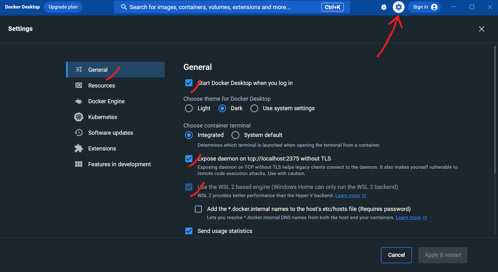

---

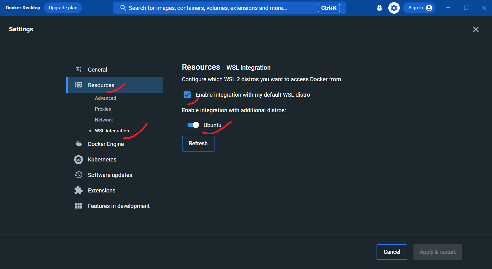

---

## 📌 Test sur WSL2

```bash
docker info
# blah² les infos docker

docker-compose --version
# docker-compose version 1.29.1, build c34c88b2

## Test avec un mini serveur local alakon
##    Lancer un nginx avec sur index.html le nom du conteneur + une image
##    Sur le port 80, en mode interactif (s'arrête via ctrl+c), et sera supprimé après utilisation
docker run -it \
  -p 8080:80 \
  --rm \
  nginx:alpine

# Unable to find image 'nginx:alpine' locally
# alpine: Pulling from library/nginx
# 540db60ca938: Pull complete
# Digest: sha256:0f8595aa040ec107821e0409a1dd3f7a5e989501d5c8d5b5ca1f955f33ac81a0
# Status: Downloaded newer image for nginx:alpine

## Aller sur http://localhost:8080/
# 172.17.0.1 - - [02/Jun/2021:09:15:06 +0000] "GET / HTTP/1.1" 200 612 "-" "Mozilla/5.0 (Windows NT 10.0; Win64; x64) AppleWebKit/537.36 (KHTML, like Gecko) Chrome/91.0.4472.77 Safari/537.36" "-"
# 2021/06/02 09:15:06 [error] 32#32: *2 open() "/usr/share/nginx/html/favicon.ico" failed (2: No such file or directory), client: 172.17.0.1, server: localhost, request: "GET /favicon.ico HTTP/1.1", host: "localhost:8080", referrer: "http://localhost:8080/"
# 172.17.0.1 - - [02/Jun/2021:09:15:06 +0000] "GET /favicon.ico HTTP/1.1" 404 555 "http://localhost:8080/" "Mozilla/5.0 (Windows NT 10.0; Win64; x64) AppleWebKit/537.36 (KHTML, like Gecko) Chrome/91.0.4472.77 Safari/537.36" "-"

## Profit

## Ctrl + C pour couper le conteneur de test
```

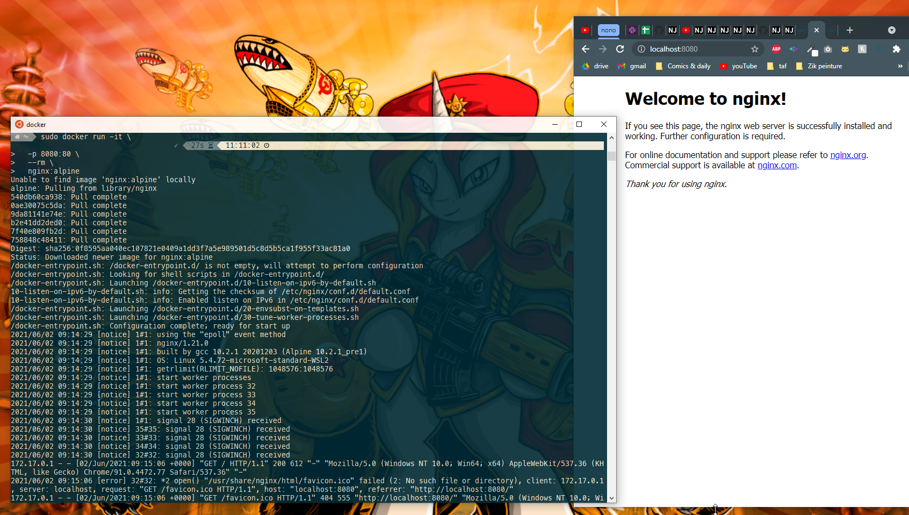

Note: En cas d'erreur `docker: Error response from daemon: Head [...] unauthorized: incorrect username or password.`

```bash
# Se connecter soit via docker desktop, doit via terminal ; avec identifiant dockerhub
docker login --username TON_USERNAME_WESH
```

---

## ⬆️ Maj Docker Desktop

1. Lancer le bousin
2. Attendre qu'il soit effectivement lancé
3. Barre des tâches > Icône > Clic droit > ~"Check for updates"
4. Attendre et lui tenir la main pendant approximativement 107 ans
5. ..
6. Profits

---

## ♻️ Maintenance

```bash
## Docker > Remove everything not used, no need to confirm
docker system prune -af
```

---
---
---

## 🐛 Problèmes rencontrés

### 🚦 Docker desktop ne démarre pas

Potentiellement lié au fait que le service est désactivé dans les réglages de démarrage

1. Afficher le gestionnaire de tâches `Ctrl` + `Shift` + `Echap`
2. Onglet "Démarrage"
3. S'assurer que `Docker desktop` a un statut "Activé"
4. Redémarrer

Au pire essayer de le lancer en tant qu'admin.

---

### 🔧 Activer la virtualisation / Vérifier que "Hyper-V" est activé

🔍 [Doc : résolution des problèmes au cas où docker desktop ne démarre pas](https://collabnix.com/error-docker-failed-to-start-docker-desktop-for-windows/#:~:text=You%20can%20try%20reinstalling%20Docker,attempting%20to%20start%20Docker%20again.)

S'assurer que les fonctionnalités windows suivantes sont activées :

1. .NET 3.5
2. .NET 4.8
3. Plateforme de l'hyperviseur Windows
4. Plateforme de machine virtuelle
5. (Sous système Windwos pour Linux, si déjà installé)
6. Windows Powershell 2.0

🚨 En cas de changement, redémarrer !🚨

---

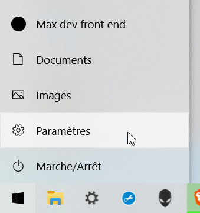

---

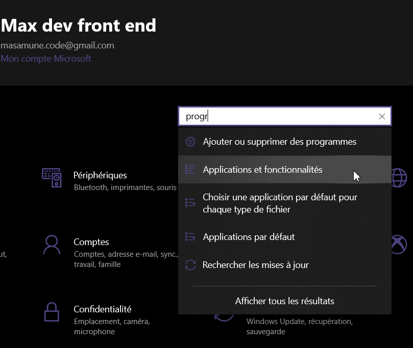

---


---

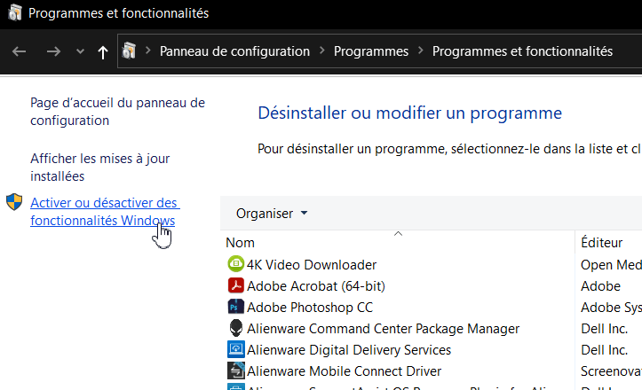

---

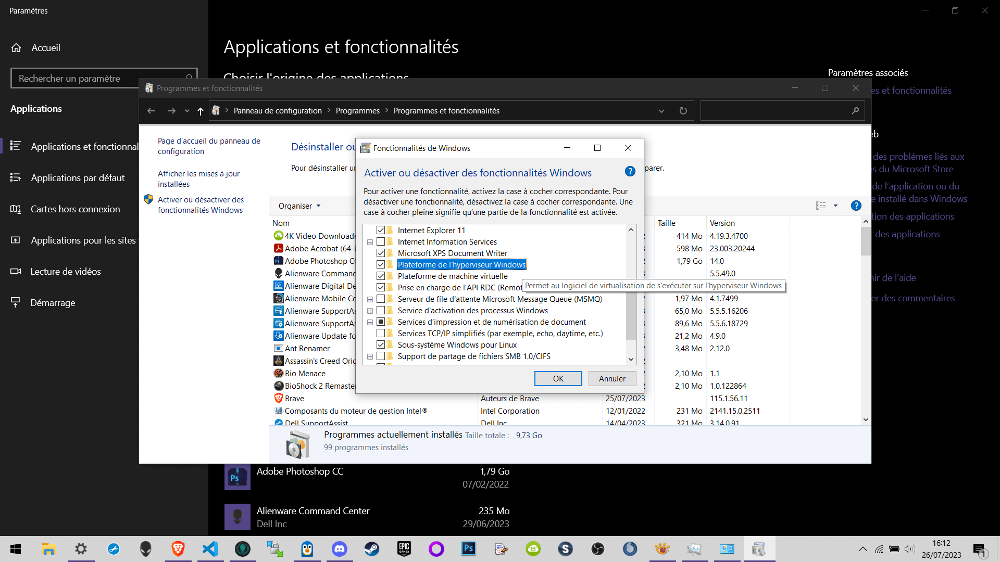

---
---
---

#### 🔧 Vérifier que cela n'est pas désactivé dans le BIOS

1. Voir sur le net comment rentrer dans le BIOS de son PC au redémarrage
   1. Assez souvent c'est en spam d'une touche entre F1 & F12 au démarrage
   2. Ou sinon une activation dans un logiciel dédié du constructeur, pour le prochain redémarrage
2. Dans le BIOS
   1. **Souvent** dans `Advanced BIOS Features` et/ou pas loin des options du `CPU`
3. 🔍👴 Un [article en ligne](https://support.bluestacks.com/hc/fr-fr/articles/115003910391--Comment-puis-je-activer-la-virtualisation-VT-sur-mon-PC) avec plus de détails

Avec une capture honteusement volée car je n'ai pas l'option sur mon pc :3

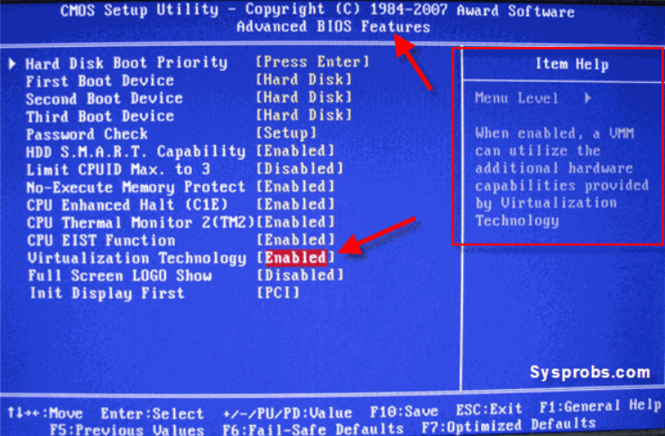

---
---
---

### 🤢 Docker > read only file system

Plus de place sur le disque dur !

Attention, docker est assez gourmand (notamment après avoir téléchargé plusieurs images), la recommandation est d'avoir ~20Go de disponible.

---
---
---

### ⬆️ Vérifier que WSL tourne bien sous la version 2

🔍 [doc](https://learn.microsoft.com/en-us/windows/wsl/install)

Et non la 1

🚨 À exécuter depuis **Powershell** (et non WSL), en 🚨mode administrateur🚨.

```bash
# Vérifier la version utilisée
wsl -l -v

# Changer la version par défaut à installer pour la 2
wsl --set-default-version 2

# SSI vous tournez sous la version 1, il faut éventuellement vérifier que la 2 est bein installée avant de changer
#     Par défaut : Ubuntu
wsl --install

# Changer la distro utilisée par la commande wsl
wsl --setdefault Ubuntu

## 🎉 Si ça ne fonctionne toujours pas, forcer l'upgrade
wsl --set-version Ubuntu 2
```

---
---
---

### ♻️✨ Au pire réinstaller

1. Gestionnaire de tâche > Fin de tâche pour docker desktop ET son service
2. Lancer l'installeur en tant qu'administrateur
3. Ne pas oublier de re-configurer

Ne pas oublier de prier RNGesus 🙏


---

#### 🧠💥 Impossible de désinstaller/réinstaller

Parfois lorsque Docker desktop est désinstallé (via Programmes & fonctionnalités), il n'est pas considéré comme tel par l'installeur qui refuse de ré-installer / réparer.

Dans ce cas appliquer le plan 🔥 total wipeout 🔥 :

1. Pour le fun, re-désinstaller de manière classique
   1. Demarrer > Programmes & fonctionnalités > Docker desktop > Désinstaller
2. Désactiver les process dans gestionnaire de tâches ET désactiver les services au démarrage
   1. Ouvrir le gestionnaire des tâches > `Ctrl` + `Alt` + `Echap`
      1. Onglet Processus > Docker desktop > clic droit > Fin de tâche
      2. Onglet démarrage > Docker Desktop > Désactiver
   2. Redémarrer
3. Supprimer dans `Program Files`
   1. Si le fichier est encore en cours d'utilisation, passer par le soft [Unlock it](https://emcosoftware.com/unlock-it/download)
4. Virer le dossier caché DANS /appData
   1. Ouvrir un explorateur de fichier
      1. Affichage > **Eléments masqués** doit être coché
      2. Aller dans `C:\Utilisateurs\TON_BLAZ\AppData\Local`
      3. Virer Docker & Docker Desktop
5. Virer entrées dans le registre avec [ccleaner](https://www.ccleaner.com/fr-fr/ccleaner/download) ou [💸 system mechanic](https://www.iolo.com/)
6. Redémarrer
7. Relancer l'installation
   1. Si toujours KO, au choix
      1. brûler le PC courant et en racheter un
      2. changer de métier/pays
      3. Formater le disque

---

🔥 *Virer les fichiers dans AppData*

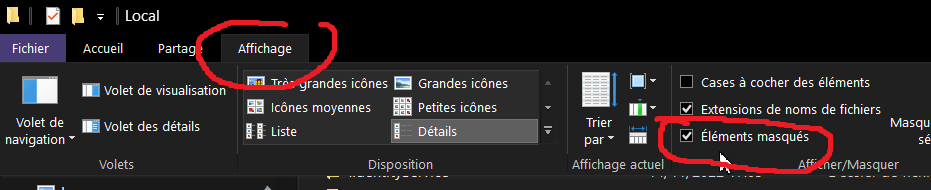

---

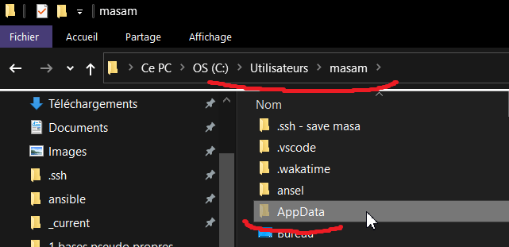

---

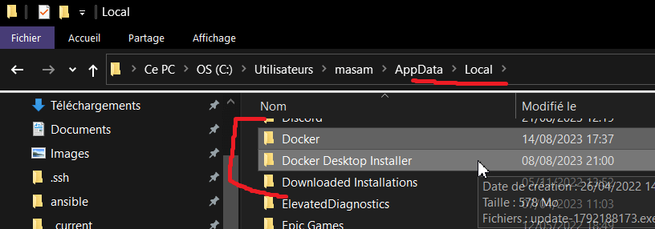

---
---
---

### 🔌❌ Problème de connexion entre WLS et le démon Docker

Dans le terminal WLS

```bash
export DOCKER_HOST=tcp://localhost:2375
echo "Docker Host is set to ${DOCKER_HOST}"
# Vérifications
docker info
docker run hello-world
```

---
---
---

### 👴 Autres pistes de l'ancien temps

A [voir ici](https://github.com/youpiwaza/server-related-tutorials/blob/master/01-docker/01-Docker-desktop/docker%20crash%20on%20boot.md).
