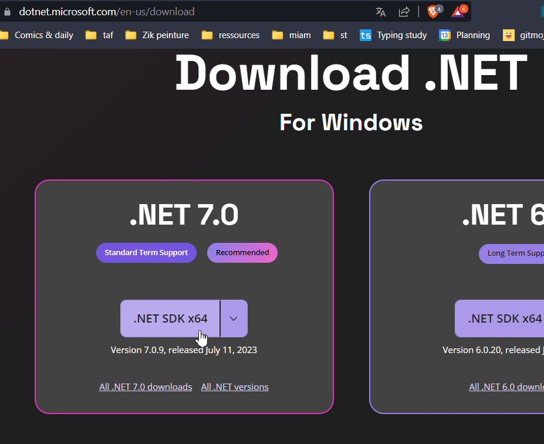
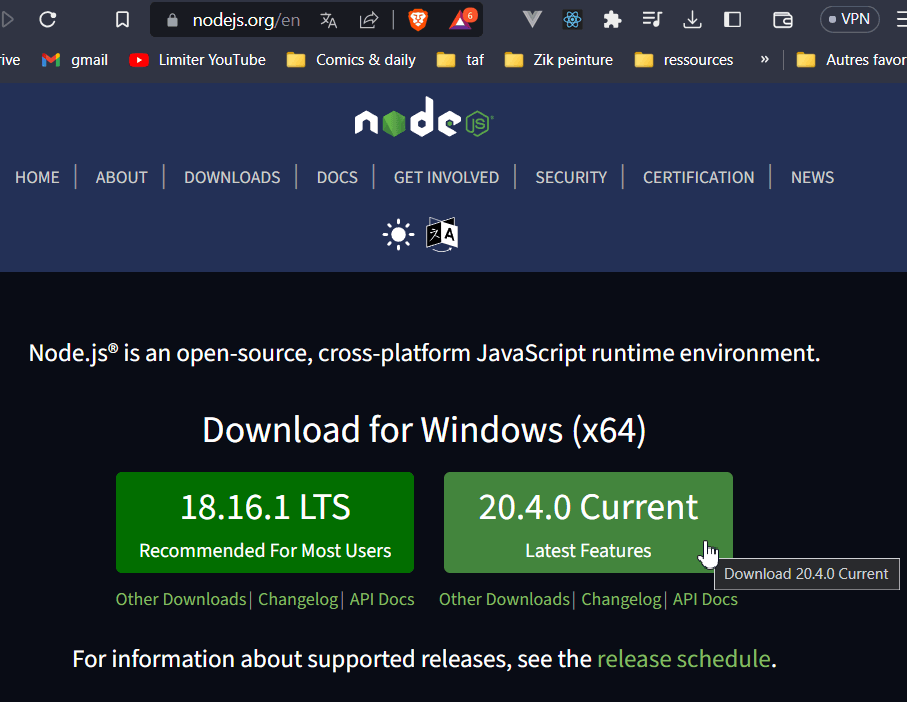

# Mise en place d'un environnement de développement

Histoire de partir sur de bonnes bases.

Installation complète d'un environnement de dev sous Windows, adaptable pour Mac & Linux.

Mac et linux > Potentiellement pas besoin d'installer certains logiciels may répercuter les commandes dans les terminaux des OS.

Comprend :

1. .NET
2. ⬆️ Mises à jour du système d'exploitation
3. 🟩 NodeJs & npm
4. 🐧 Un terminal "propre" / WSL2
5. 🐳 Docker via Docker Desktop
6. 🤖 Ansible
7. 🖥️ L'éditeur de code VSCode
8. ♻️ La maintenance

---

*Lexique* :

- WSL / 🐧 Windows Linux Subsystem (Ubuntu "natif" sur windows)
- ZSH / 🖥️ Un terminal (ligne de commande, comme *shell*/*bash* may mieux)
- OMZ / 💅 Oh-My-Zsh, moteur de thème pour ZSH ^
- p10k / 🐲 Le thème *PowerLevel10k* pour OMZ

🚨👴 À noter que tout cela évolue au fil du temps, et devra peut être être adapté

---

## .NET (dotNET)

Installation simple & rapide de .NET (dot Net), **à voir si ça passe pour Mac et Linux**

*Optionnel*, mais peut prévenir pas mal de problèmes

1. Se rendre sur le site officiel : [https://dotnet.microsoft.com/en-us/download](https://dotnet.microsoft.com/en-us/download)
2. Télécharger la dernière version
3. Installer

---

## ⬆️ Mises à jour du système d'exploitation

🚨 Optionnel mais recommandé, et prendre l’habitude ♻️

1. Windows
   1. Démarrer > "Update" > Relancer plein de fois
2. [Mac](https://support.apple.com/fr-fr/HT201541)
3. Linux > [Mes recos (pour WSL, reprendre les commandes de maintenance)](https://github.com/youpiwaza/install-dev-env/blob/master/01-terminal/README.md)

### ✨ Bonus / Mise à jour des drivers en vrai

Tous les drivers > [Logiciel Mes drivers](https://www.touslesdrivers.com/index.php?v_page=29)

---

## 🟩 NodeJs & npm

Installation simple & rapide de Node & npm pour l’ensemble des OS

1. Se rendre sur le site officiel : [https://nodejs.org/](https://nodejs.org/)
2. Télécharger la **dernière version**, et non la LTS
3. Installer

---

## 🐧 Installer le terminal sur Windows > WSL2 (Windows Sub Linux > Ubuntu 22) : OMZ & p10K

[Readme dédié](01-terminal/README.md)

*Comprend* :

- WSL2 : installation, configuration, mise à jour de Ubuntu
  - Installation des paquets usels
- zsh & OMZ & thème p10k
- Ansible : installation via un script
- CLI github, installation via homebrew (installé également)

---

## 🐳 Installation de Docker et ses potes

[Readme dédié](02-docker/README.md)

---

## 🤖 Installation de Ansible

[Readme dédié](03-ansible/README.md)

---

## 🖥️ Mise en place de l'éditeur de texte / VSCode

[Readme dédié](04-vscode/README.md)

---

## ♻️ Maintenance

Processus afin de TOUT [garder à jour / propre](./maintenance.md).

---
